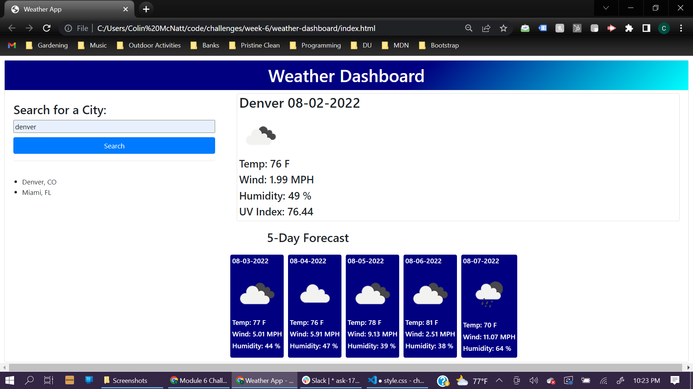

# Weather Dashboard

This Weather Dashboard allows the user to search a city and get weather updates for that city. Users will be able to view both current weather, as well as the upcoming 5 day forecast. When the user searches for a city the previous searches are saved and can be clicked to bring back the weather data for that city

## Mock Up

## Link to Functioning Application

https://colinmichael89.github.io/Weather-Dashboard/
